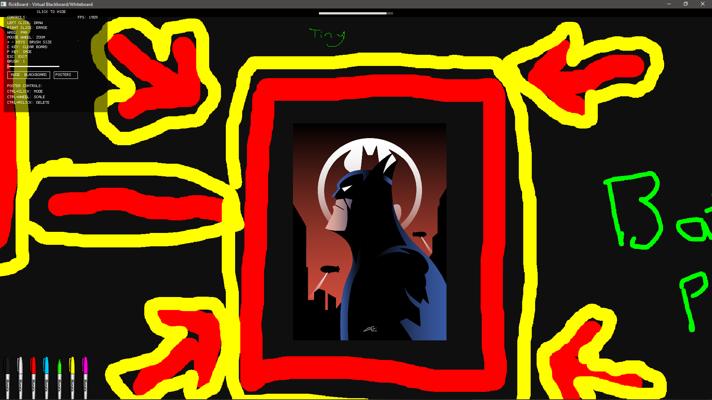
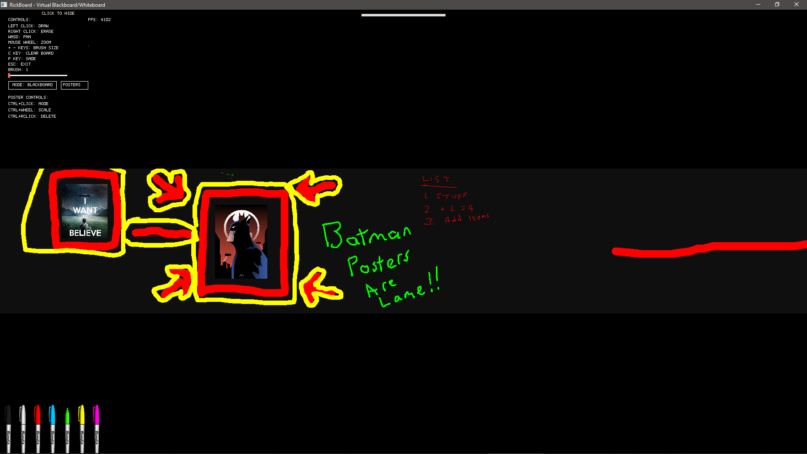
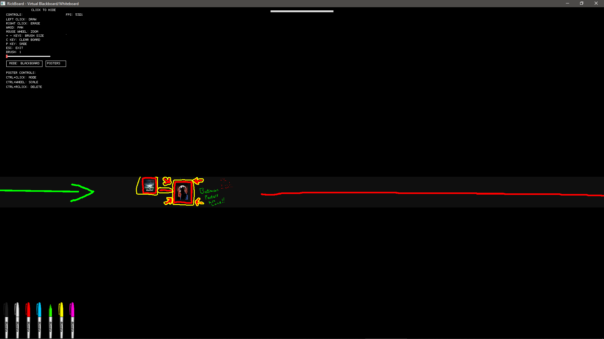
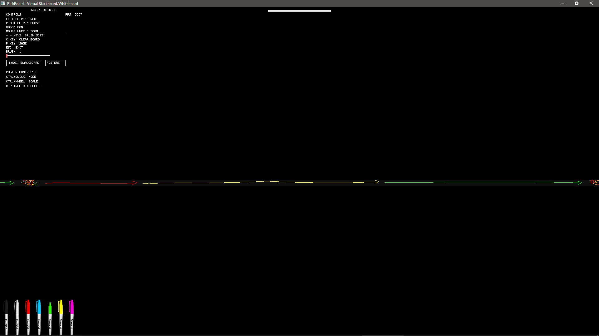

# RickBoard

A high-performance virtual blackboard/whiteboard application built in Rust with disk-backed storage and cylindrical horizontal wrapping.

## Screenshots

<details>
<summary>Click to view screenshots at different zoom levels</summary>

<a href="screenshots/desktop_00.png"></a>
<a href="screenshots/desktop_01.png"></a>
<a href="screenshots/desktop_02.png"></a>
<a href="screenshots/desktop_03.png"></a>

</details>

## Features

### Canvas
- **Massive canvas**: 80,000 × 1,000 pixels (~320MB)
- **Dual modes**: Blackboard (dark) and Whiteboard (light)
- **Cylindrical wrapping**: Infinite horizontal scrolling
- **Disk-backed storage**: All drawings persist to `rickboard.data`
- **Auto-save**: Saves every 60 seconds when changes are made
- **Undo support**: Up to 3 levels of undo (Ctrl+Z)

### Drawing Tools
- **Adjustable brush**: Size ranges from 1-100 pixels
- **Eraser mode**: Right-click to erase
- **Color markers**: 7 colors with visual selection
  - Black, White, Red, Blue (Dodger Blue), Green, Yellow, Pink (Magenta)
- **Smart color filtering**: Markers adapt to current mode (no black marker in blackboard mode, no white marker in whiteboard mode)

### Performance
- **60 FPS rendering**: Parallel CPU rendering with rayon
- **Optimized I/O**: Minimal disk writes, only when necessary
- **Real-time viewport**: Smooth panning and zooming
- **Live FPS counter**: Displayed in legend panel

## Controls

### Mouse
- **Left Click + Drag**: Draw with current color
- **Right Click + Drag**: Erase
- **Mouse Wheel**: Zoom in/out
- **Click Mode Button**: Toggle Blackboard ↔ Whiteboard
- **Click Color Marker**: Select drawing color
- **Click Posters Button**: Open poster selection menu

### Poster Controls
- **Ctrl + Left Click**: Grab and drag poster to reposition (preserves relative offset from click point)
- **Ctrl + Scroll Wheel**: Scale poster size (range: 0.1x to 10x of original dimensions)
- **Ctrl + Right Click**: Delete selected poster from the canvas
- **Posters Button**: Opens overlay showing all images in the `posters/` folder for selection
- **Poster Placement**: After selection, click anywhere on canvas to pin the poster

### Keyboard
- **W**: Pan up
- **A**: Pan left
- **S**: Pan down
- **D**: Pan right
- **+/=** or **Numpad +**: Increase brush size
- **-** or **Numpad -**: Decrease brush size
- **C**: Clear entire board
- **P**: Manual save (resets auto-save timer)
- **Ctrl+Z**: Undo last 3 drawing operations
- **ESC**: Exit application

## User Interface

### Legend Panel (Top-Left)
- Semi-transparent background that adapts to board mode
- **Collapsible**: Click top bar to hide/show with smooth slide animation
- Complete control reference
- Brush size slider with live preview
- FPS counter in top-right corner
- Mode toggle button
- Posters button
- Poster controls reference

### Progress Bar (Top-Center)
- Shows time until next auto-save (60-second cycle)
- Displays "Saving..." message when save is in progress
- Styled to match current board mode

### Color Markers (Bottom-Left)
- Visual color selection with open/closed states
- 50% scaled from 60×256 pixel PNG images
- Highlights currently selected color

## Technical Details

### Architecture
- **Language**: Rust 1.91.1
- **Graphics**: pixels 0.15.0, winit 0.30.12
- **Parallel Processing**: rayon 1.11.0
- **Image Loading**: image 0.25
- **Serialization**: serde 1.0, serde_json 1.0 (for poster persistence)

### File Format
- **Header**: 9 bytes (mode: 1 byte, width: 4 bytes LE, height: 4 bytes LE)
- **Pixel Data**: RGBA format, stored sequentially
- **File Size**: ~320MB for 80,000×1,000 canvas

### Memory Usage
- **Canvas cache**: ~320MB (RGBA buffer)
- **Undo stack**: ~960MB (3 states × 320MB)
- **Total**: ~1.28GB RAM

### Rendering
- **Viewport-based**: Only renders visible portion
- **Parallel processing**: CPU-based with rayon for maximum utilization
- **Alpha blending**: Transparent UI overlays
- **Cylindrical projection**: Horizontal wrapping for infinite scrolling
- **Poster rendering**: Drawn after canvas, before UI elements
  - Applies viewport transformations (pan/zoom)
  - Supports individual poster scaling with interpolation
  - Cylindrical wrapping with dx offset calculation
  - Alpha channel blending for transparent poster regions

### Save Mechanism
- **Auto-save**: Every 60 seconds (only if changes detected)
- **Manual save**: Press P (resets timer)
- **Smart saving**: Tracks unsaved changes, skips unnecessary saves
- **Progress feedback**: Visual progress bar and saving indicator
- **On exit**: Automatic save before closing

### Mode Switching
- **Color preservation**: Colored pixels remain unchanged
- **Black/White inversion**: Pure black ↔ white when toggling modes
- **Background swap**: Old background → new background
- **Instant feedback**: Syncs to disk immediately

## Building

```powershell
# Debug build
cargo build

# Release build (optimized)
cargo build --release

# Run
cargo run --release
```

## Running

```powershell
# From build directory
.\target\release\rickboard.exe

# Or via cargo
cargo run --release
```

## File Structure

```
rickboard/
├── src/
│   └── main.rs          # Complete application (~1,720 lines)
├── assetts/
│   ├── black_marker_open.png
│   ├── black_marker_closed.png
│   ├── white_marker_open.png
│   ├── white_marker_closed.png
│   ├── red_marker_open.png
│   ├── red_marker_closed.png
│   ├── blue_marker_open.png
│   ├── blue_marker_closed.png
│   ├── green_marker_open.png
│   ├── green_marker_closed.png
│   ├── yellow_marker_open.png
│   ├── yellow_marker_closed.png
│   ├── pink_marker_open.png
│   └── pink_marker_closed.png
├── posters/             # User-provided images for poster system
│   └── (add .png, .jpg, .jpeg files here)
├── Cargo.toml           # Dependencies
├── rickboard.data       # Canvas storage (created on first run)
├── posters.json         # Poster positions, scales, images (auto-created)
└── README.md
```

## Data Persistence

### Canvas Data
All drawings are automatically saved to `rickboard.data` in the application directory. This file:
- Persists between sessions
- Can be backed up/restored
- Can be deleted to start fresh
- Contains the complete canvas state

### Poster Data
Poster configurations are saved to `posters.json` with the following structure:
```json
[
  {
    "position": {"x": 1000, "y": 500},
    "image_data": [/* PNG/JPEG bytes */],
    "width": 800,
    "height": 600,
    "name": "poster.png",
    "scale": 1.5
  }
]
```
- Automatically saved when posters are added, moved, scaled, or deleted
- Image data embedded in JSON (base64-encoded bytes)
- Supports backward compatibility (missing scale defaults to 1.0)
- Can be deleted to clear all posters

## Performance Characteristics

- **Startup**: Fast (loads existing canvas or creates new one)
- **Drawing**: Real-time with adjustable brush sizes
- **Saving**: Background operation, non-blocking (320MB write)
- **Undo**: Instant (memory swap operation)
- **Mode Toggle**: Immediate with full canvas color transformation
- **Frame Rate**: 40-60 FPS (depends on viewport size and hardware)

## Known Limitations

- Undo stack limited to 3 operations
- Undo stack not persisted (cleared on exit)
- Canvas height fixed at 1,000 pixels (width wraps infinitely)
- No network/collaboration features
- Desktop-only (Windows/Linux/macOS via winit)

## Color Reference

| Color Name | RGB Values | Mode Availability |
|-----------|-----------|------------------|
| Black | 0, 0, 0 | Whiteboard only |
| White | 255, 255, 255 | Blackboard only |
| Red | 255, 0, 0 | Both |
| Blue | 30, 144, 255 | Both |
| Green | 0, 255, 0 | Both |
| Yellow | 255, 255, 0 | Both |
| Pink | 255, 0, 255 | Both |

## System Requirements

- **OS**: Windows, Linux, or macOS
- **RAM**: 2GB minimum (for canvas + undo stack)
- **Disk**: 320MB for canvas file
- **Display**: Any resolution (windowed mode, resizable)

## License

CHECK LICENSE.MD

## Author

ATORQUE
